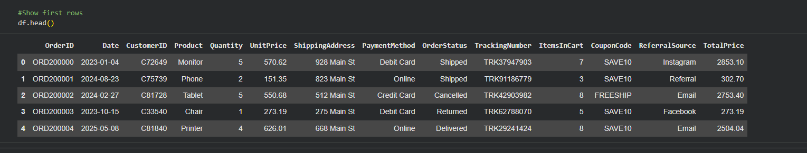
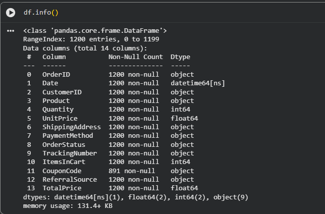
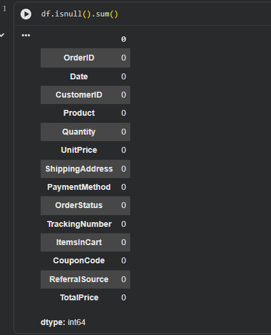

# DecodeLabs Week 2 - Data Cleaning with Python and Pandas

## Project Overview

This project was completed as part of the DecodeLabs Data Science Internship Program.

The objective of this project was to perform data cleaning and exploratory data analysis using Python and Pandas. The project focused on understanding dataset structure, identifying missing values, and preparing data for further analysis.

## Objectives

* Load and inspect the dataset
* Examine dataset structure and data types
* Identify missing values
* Analyze dataset quality
* Prepare data for future analysis
* Practice data cleaning techniques

## Tools Used

* Python
* Jupyter Notebook
* Pandas
* NumPy

## Project Files

* Week2_Part2_Data_Cleaning.ipynb
* df_head.png
* df_info.png
* missing_values.png

## Skills Demonstrated

* Data Cleaning
* Exploratory Data Analysis (EDA)
* Data Validation
* Missing Value Analysis
* Data Inspection
* Problem Solving

## Project Screenshots

### Dataset Preview

### Dataset Information

### Missing Values Analysis

## Results

The project successfully evaluated dataset quality and identified areas requiring cleaning and preparation.

Key outcomes included:

* Reviewing dataset structure
* Understanding column data types
* Identifying missing values
* Assessing data completeness
* Preparing the dataset for future analysis

## What I Learned

Through this project, I gained practical experience using Pandas to inspect datasets, analyze data quality, identify missing values, and prepare data for analytical workflows. I also strengthened my understanding of exploratory data analysis techniques used by data analysts and data scientists.

## Author

**Eddy Bartolome**

DecodeLabs Data Science Internship Program
